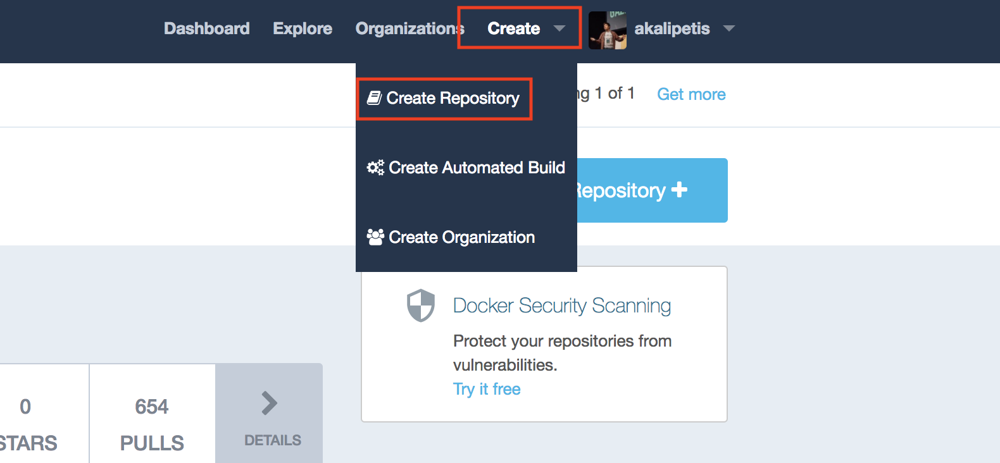

# Deploying Multi-OS applications with Docker CE

## (Play With Docker Version)

Docker CE 17.06 is the first Containers-as-a-Service platform to offer production-level support for the integrated management and security of Linux AND Windows Server Containers.

In this lab we'll use a Docker CE cluster comprised of Windows and Linux nodes. We'll deploy both a Linux and Windows web app, as well as a multi-service application that includes both Windows and Linux components. We will then look at scaling up your web app, as well how Docker CE handles system interruptions and upgrades.

**Difficulty**: Intermediate (assumes basic familiarity with Docker)
**Time**: Approximately 75 minutes
**Tasks**:
* [Task 1: Configure the Docker CE Cluster](#task1)
  * [Task 1.1: Accessing PWD](#task1.1)
  * [Task 1.2: Install a Windows worker node](#task1.2)
  * [Task 1.3: Create Two Repositories](#task1.3)
* [Task 2: Deploy a Linux Web App](#task2)
  * [Task 2.1: Clone the Demo Repo](#task2.1)
  * [Task 2.2: Build and Push the Linux Web App Image](#task2.2)
  * [Task 2.3: Deploy the Web App using UCP](#task2.3)
* [Task 3: Deploy a Windows Web App](#task3)
  * [Task 3.1: Create the Dockerfile with Image2Docker](#task3.1)
  * [Task 3.2: Build and Push Your Image to Docker Trusted Registry](#task3.2)
  * [Task 3.3: Deploy the Windows Web App](#task3.3)
* [Task 4: Deploy a Multi-OS Application](#task4)
  * [Task 4.1: Examine the Docker Compose File](#task4.1)
  * [Task 4.2: Deploy the Application Stack](#task4.2)
  * [Task 4.3: Verify the Running Application](#task4.3)
* [Task 5: Application Lifecycle Management](#Task5)
  * [Task 5.1: Upgrading the Web Front-end](#Task5.1)
  * [Task 5.2: Scaling the Web Front-end](#Task5.2)
  * [Task 5.3: Dealing with an Application Failure](#Task5.3)

## <a name="task1"></a>Task 1: Configure the Docker CE Cluster

Go to https://microsoft.play-with-docker.com and start a new session.

Create two Linux nodes and initialize the first Linux node as a manager (`docker swarm init --advertise-addr=eth0`). Then join the other node as a worker.

### <a name="task1.2"></a>Task 1.2: Install a Windows worker node

Let's start by adding our 3rd node to the cluster, a Windows Server 2016 worker node.

1. From the main PWD screen click the `Windows containers` checkbox on the left side of the screen

2. Click the `Add new instance` button.

3. In the terminal, type the join command that you used to join the Linux worker node

### <a name="task1.3"></a>Task 1.3: Create Two Repositories in Docker Hub

Docker Hub is the place to store your Docker images, think of it as the GitHub for your Docker images.

1. Go to https://hub.docker.com/
2. Sign up (you can create a new account for the workshop if you don't want to use your primary credentials throughout the workshop)
3. Create two new repositories
	* `<user-name>/linux_tweet_app`
	* `<user-name>/windows_tweet_app`

	

Congratulations you have created two new repositories.

## <a name="task2"></a>Task 2: Deploy a Linux Web App

Now that we've completely configured our cluster, let's deploy a couple of web apps. These are simple web pages that allow you to send a tweet. One is built on Linux using NGINX and the other is build on Windows Server 2016 using IIS.  

Let's start with the Linux version.

### <a name="task2.1"></a> Task 2.1: Clone the Demo Repo


1. From PWD select the Linux worker node.

2. Use git to clone the workshop repository.

	```
	$ git clone https://github.com/akalipetis/hybrid-workshop.git
	```

	You now have the necessary demo code on your worker host.

### <a name="task2.2"></a> Task 2.2: Build and Push the Linux Web App Image


1. Change into the `linux_tweet_app` directory.

	`$ cd ./hybrid-workshop/linux_tweet_app/`

2. Use `docker build` to build your Linux tweet web app Docker image.

	`$ docker build -t <user-name>/linux_tweet_app .`

	> **Note**: Be sure to substitute your Docker Hub username.

	The `-t` tags the image with a name. In our case the name indicates which DTR server and under which user's respository the image will live.

	> **Note**: Feel free to examine the Dockerfile in this directory if you'd like to see how the image is being built.

	Your output should be similar to what is shown below

	```
	Sending build context to Docker daemon  4.096kB
	Step 1/4 : FROM nginx:latest
	latest: Pulling from library/nginx
	ff3d52d8f55f: Pull complete
	b05436c68d6a: Pull complete
	961dd3f5d836: Pull complete
	Digest: sha256:12d30ce421ad530494d588f87b2328ddc3cae666e77ea1ae5ac3a6661e52cde6
	Status: Downloaded newer image for nginx:latest
	 ---> 3448f27c273f
	Step 2/4 : COPY index.html /usr/share/nginx/html
	 ---> 72d22997a765
	Removing intermediate container e262b9220942
	Step 3/4 : EXPOSE 80 443
	 ---> Running in 54e4ff1b39a6
	 ---> 2b5bd87894cd
	Removing intermediate container 54e4ff1b39a6
	Step 4/4 : CMD nginx -g daemon off;
	 ---> Running in 54020cdec942
	 ---> ed5f550fc339
	Removing intermediate container 54020cdec942
	Successfully built ed5f550fc339
	Successfully tagged  <user-name>/linux_tweet_app:latest
	```

3. Log into Docker Hub from the command line

	```
	$ docker login
	Username: <your username>
	Password: <your password>
	Login Succeeded
	```
4. Use `docker push` to upload your image up to Docker Trusted Registry.

	```
	$ docker push <user-name>/linux_tweet_app
	```

	The output should be similar to the following:

	```
	The push refers to a repository [<user-name>/linux_tweet_app]
	feecabd76a78: Pushed
	3c749ee6d1f5: Pushed
	af5bd3938f60: Pushed
	29f11c413898: Pushed
	eb78099fbf7f: Pushed
	latest: digest: sha256:9a376fd268d24007dd35bedc709b688f373f4e07af8b44dba5f1f009a7d70067 size: 1363
	```

4. In your web browser head back to your Docker Hub account to see the newly pushed image.

### <a name="task2.3"></a> Task 2.3: Deploy the Web App

Now let's run our application by by creating a new service.

In order to create the service, we'll need to define:
* the `image` that will run
* the `ports` that are going to be exposed

The command to create a service is the following one:
Services can only be created from the swarm master. This command must be run from the master node. 

```bash
docker service create --publish 8088:80 <user-name>/linux_tweet_app
```

Services are application building blocks (although in many cases an application will only have one service, such as this example). Services are based on a single Docker image. When you create a new service you instantiate at least one container automatically, but you can scale the number up (or down) to meet the needs of your service.

After a few seconds you should see a the port being exposed to your PWD interface, which you can click and see it live.

### Extra Credit: Ingress Load Balancing

Go to whichever Linux node you want and type the following command:

```bash
curl localhost:8088
```

Did you see the application?

This is an example of the built in ingress load balancer in Docker CE. Regardless of where a Linux-based service is actually running, you can access it from any Linux node in the cluster. So, if it's running on the manager in our cluster, you can still get to it by accessing the worker node. Docker CE can accept the request coming into any of the Linux nodes in the cluster, and route it to a host that's actually running a container for that service.

## <a name="task3"></a>Task 3: Deploy a Windows Web App

Now we'll deploy the Windows version of the tweet app.

### <a name="task3.1"></a> Task 3.1: Create the dockerfile with Image2Docker

There is a Windows Server 2016 VHD that contains our Windows Tweet App stored in `c:\` on Windows host. We're going to use Image2Docker to scan the VHD, and create a Dockerfile. We'll build the Dockerfile as we did in the previous step, push it to DTR, and then deploy our Windows tweet app.


1. Click the name of your Windows host in PWD to switch your web console.

2. Set up the Image2Docker PowerShell module - you need to install the module, and then import it to make it available in the session. Copy ans paste this command into the Windows console:

```
Install-Module -Force Image2Docker

Import-Module Image2Docker
```


3. Use Image2Docker's `ConvertTo-Dockerfile` command to create a dockerfile from the VHD.

	Copy and paste the command below into your Windows console window.

	```
	ConvertTo-Dockerfile -ImagePath c:\ws2016.vhd -Artifact IIS -OutputPath C:\windowstweetapp -Verbose
	```

	As mentioned before Image2Docker will scan the VHD, and extract out a Dockerfile based on the contents of the VHD. The list below explains the command line aruguments.

	* `ImagePath` specifies where the VHD can be found

	* `Artifact` specifies what feature or code to look for

	* `OutputPath` specifies where to write the dockerfile and other items

	* `Verbose` instructs the script to provide extra output.

When the process completes you'll find a dockerfile in `c:\windowstweetapp`


### <a name="task3.2"></a> Task 3.2: Build and Push Your Image to Docker Hub


1. CD into the `c:\windowstweetapp` directory (this is where your Image2Docker files have been placed).

	`PS C:\> cd c:\windowstweetapp\`


2. Use `docker build` to build your Windows tweet web app Docker image.

	`$ docker build -t <user-name>/windows_tweet_app .`

	> **Note**: Feel free to examine the Dockerfile in this directory if you'd like to see how the image is being built.

	Your output should be similar to what is shown below

	```
	PS C:\windowstweetapp> docker build -t <user-name>/windows_tweet_app .

	Sending build context to Docker daemon  415.7kB
	Step 1/8 : FROM microsoft/iis:windowsservercore-10.0.14393.1715
	 ---> 590c0c2590e4

	<output snipped>

	Removing intermediate container ab4dfee81c7e
	Successfully built d74eead7f408
	Successfully tagged <user-name>/windows_tweet_app:latest
	```
	> **Note**: It will take a few minutes for your image to build.

4. Log into Docker Trusted Registry

	```
	PS C:\> docker login <dtr hostname>
	Username: <your username>
	Password: <your password>
	Login Succeeded
	```

5. Push your new image up to Docker Trusted Registry.

	```
	PS C:\Users\docker> docker push <your username>/windows_tweet_app
	The push refers to a repository [<your username>/windows_tweet_app]
	5d08bc106d91: Pushed
	74b0331584ac: Pushed
	e95704c2f7ac: Pushed
	669bd07a2ae7: Pushed
	d9e5b60d8a47: Pushed
	8981bfcdaa9c: Pushed
	25bdce4d7407: Pushed
	df83d4285da0: Pushed
	853ea7cd76fb: Pushed
	55cc5c7b4783: Skipped foreign layer
	f358be10862c: Skipped foreign layer
	latest: digest: sha256:e28b556b138e3d407d75122611710d5f53f3df2d2ad4a134dcf7782eb381fa3f size: 2825
	```

### <a name="task3.3"></a> Task 3.3: Deploy the Windows Web App
Now that we have our Windows Tweet App, let's deploy it. It's going to be almost identical to how did the Linux version with a couple of one small exceptionn: Docker CE on Windows Server 2016 does not currently support ingress load balancing, so we'll exposer the ports in `host` mode using `dnsrr`

In order to create the service, just run:

```bash
docker service create \
	--endpoint-mode=dnsrr\
	--publish=mode=host,target=80,published=8082 \
	<your-username>/windows_tweet_app
```

After a few seconds you should see a button in your PWD interface with the exposed port.

## <a name="task4"></a> Task4: Deploying a Multi-OS Application

For our last exercise we'll use a docker compose file to deploy an application that uses a Java front end designed to be deployed on Linux, with a Microsoft SQL Server back end running on windows.

### <a name="task4.1"></a> Task 4.1: Examine the Docker Compose file

We'll use a Docker Compose file to instantiate our application. With this file we can define all our services and their parameters, as well as other Docker primatives such as networks.

Let's look at the Docker Compose file:

```
version: "3.2"

services:

  database:
    image: sixeyed/atsea-db:mssql
    ports:
      - mode: host
        target: 1433
    networks:
     - atsea
    deploy:
      endpoint_mode: dnsrr

  appserver:
    image: mikegcoleman/atsea_appserver:1.0
    ports:
      - target: 8080
        published: 8080
    networks:
      - atsea

networks:
  atsea:
```

There are two services. `appserver` is our web frontend written in Java, and `database` is our Microsoft SQL Server database. The rest of the commands should look familiar as they are very close to what we used when we deployed our tweet services manually.

One thing that is new is the creation of an overlay network (`atsea`). Overlay networks allow containers running on different hosts to communicate over a private software-defined network. In this case, the web frontend on our Linux host will use the `atsea` network to communicate with the database.

### <a name="task4.2"></a> Taks 4.2 Deploy the Application Stack

A `stack` is a group of related services that make up an application. Stacks are a newer Docker primative, and can be deployed with a Docker Compose file.

Let's Deploy an application stack using the Docker Compose file above.

```bash
docker stack deploy -c docker-compose.yml atsea
```

You can watch your stack services doing:

```bash
docker stack services atsea
```

### <a name="task4.3"></a> Task 4.3: Verify the Running Application

1. To see our running web site (an art store) visit the `8080` port tag in your PWD interface.

## <a name="task5"></a> Task 5: Application Lifecycle Management

Now that we've deployed our application, let's take a look at some common tasks that admins need to do to keep their apps running and up-to-date. We'll start by upgrading the web front end, next we'll scale that service to meet demand, and then finally we'll see how to deal with the failur of a node in our UCP cluster.

### <a name="task5.1"></a> Task 5.1: Upgrading the Web Front-end

In this section we're going to first simulate a failed upgrade attempt, and see how to deal with that. The way we upgrade a running service is to update the image that service is based on. In this case the image we're going to upgrade to is broken. So when it's deployed UCP will pause the upgrade process, from there we can roll the application back to it's previous state.

Chante the image of the `appserver` service to `mikegcoleman/atsea_appserver:2.0` and deploy your stack again.

Inspect the services of your stack again and you'll see that the `appserver` is now not running.

Inspect this further by running:

```bash
docker service ps atsea_appserver
```

You'll see something like the output below.

```
ID                  NAME                    IMAGE                              NODE                DESIRED STATE       CURRENT STATE                ERROR                              PORTS
nmhwz5wqln3w        atsea_appserver.1       mikegcoleman/atsea_appserver:2.0   node1               Running             Starting less than a second ago
zentwtjyfz95         \_ atsea_appserver.1   mikegcoleman/atsea_appserver:2.0   node1               Shutdown            Failed 5 seconds ago             "task: non-zero exit (143): do…"
5tp2a1x7s1hr         \_ atsea_appserver.1   mikegcoleman/atsea_appserver:1.0 node1               Shutdown            Shutdown 24 seconds ago
```

Now that we've dealt with a failed upgrade, let's look at rolling out a successful upgrade. All you need to do is run the command below:

```bash
docker service update --image=mikegcoleman/atsea_appserver:1.0 atsea_appserver
```

**This has been further improved in the latest version, but Windows have not been updated yet, otherwise you could just do:**

```bash
docker service rollback atsea_appserver
```

### <a name="task5.2"></a> Task 5.2: Scaling the Web Front-end

The new site design appears to dramatically increased the popularity of your website. In order to deal with increased demand, you're going to need to scale up the number of containers in the `atsea_appserver` service.

In order to scale a service, all you have to do is:

```bash
docker service scale atsea_appserver=4
```

After a few seconds or so you'll see can check the services of your stack go to `4/4`

Go to your website in your brower and refresh the page, you will notice in the upper right the IP and Host change. This output is the IP and container ID of the actual container that served up the web page.

> **Note**: If you are not running in an incognito window you may need to force your browser to ignore the cache in order to see the values change. Consult the help section of your browser to learn how to do this.

Everything seems to be humming along nicely until one of your nodes in the cluster fails. In the next section we'll show how Docker CE deals with these sort of failuers.

### <a name="5.3"></a> Task 5.3: Dealing with an Application Failure

Docker CE will always try and reconcile your services to their desired state. For instance, in the case of our web frontend, we have specified we want four containers running. If for some reason the number ever drops below four, Docker CE will attempt to get the service back to four containers.

In this section we're going to simulate a node failure and see how Docker CE handles the situation. We're not actually going to crash a node. What we're going do do is put our worker node in `Drain` mode - which is essentially maintenance mode. We are telling Docker CE to shut all the containers that are running on that node down, and not schedule any additional work on to that node.

1. Move to the manager node

2. List node by doing `docker node ls`

3. Drain the manager node from containers by doing `docker node update --availability=drain node1`

4. Watch services by doing `watch -n 2 'docker stack services atsea'`


## Conclusion
In	this lab we've looked how Docker CE can help you manage both Linux and Windows workloads whether they be traditioanl apps you've modernized or newer cloud-native apps. We also looked at how to deal with upgrades, scaling, and system failures.

You can find more information on Docker EE at [http://www.docker.com](http://www.docker.com/enterprise-edition) as well as continue exploring using our hosted trial at [https://dockertrial.com](https://dockertrial.com)
